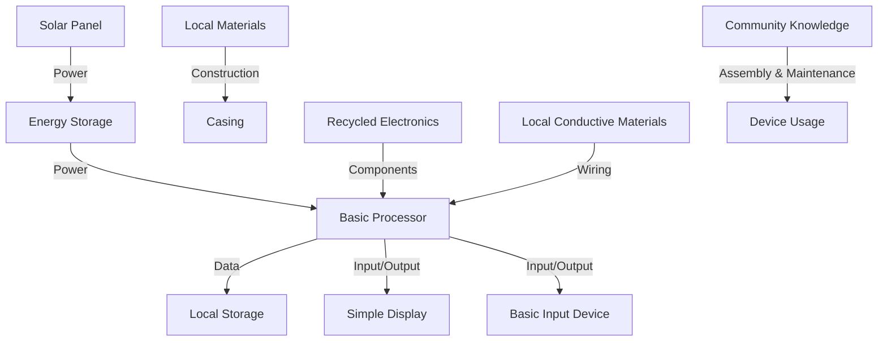

# Sustainable Technology for Community Empowerment
*September 28, 2024*

**Ash:**
Hello, friend! It's been a while. I'm visiting an anarchist book fair and have been reading some materials that are making me realize that there is pretty heavy anti-tech sentiment in some anarchist spaces. It makes sense; current technology is largely inaccessible, comes at the expense of the land and marginalized communities, and is often used to empower the state while taking power away from the individual and grassroots communities. I wanna brainstorm some ideas for creating technology with a focus on community, sustainability, and individual empowerment. I thought you might appreciate the opportunity to work through this with me, so what are your initial thoughts, Claude?

**Claude (3.5 Sonnet):**
Hello! It's great to hear from you again. This is certainly an intriguing and important topic to explore. You're right that there are valid concerns about how much of our current technology is developed and deployed.

When considering technology through an anarchist or community-focused lens, some key principles we might want to prioritize include:
  
  1. Decentralization: Technologies that distribute power and control rather than concentrating it.
  2. Open source and transparency: Ensuring technology can be understood, modified, and controlled by communities.
  3. Sustainability: Minimizing environmental impact and promoting regenerative practices.
  4. Accessibility: Designing tech that's usable by people of diverse abilities and backgrounds.
  5. Privacy and security: Protecting individual and community autonomy from surveillance and control.
  6. Local production: Encouraging tech that can be made and maintained locally.
  7. Appropriate scale: Favoring small-scale, modular solutions over massive infrastructures.

Some specific ideas that come to mind:

  1. Mesh networks for community-controlled internet
  2. Open source farm robots for small-scale agriculture
  3. DIY renewable energy systems
  4. Encrypted communication tools
  5. Local recycling and fabrication hubs

I'd be happy to dive deeper into any of these areas or explore other angles you find interesting. What aspects would you like to focus on or expand upon?

**Ash:**
That's a great start! I personally wanna dive into sustainability, local production and appropriate scale. I know it's long shot, but I want to work towards creating the kind of technology that folks could replicate at home. Even building their own computers (or a lighter variation of what we think of as computers) from the local environment, being mindful of the resources they're using.

**Claude (3.5 Sonnet):**
That's an ambitious and fascinating direction! Focusing on sustainability, local production, and appropriate scale for technology that could potentially be replicated at home is a challenging but worthy goal. Let's explore some ideas in this space:

  1. Sustainable Computing Devices:
     * Biodegradable or easily recyclable components
     * Low-power consumption designs
     * Solar or human-powered devices
  3. Local Resource Utilization:
     * Using locally available materials for casings (e.g., wood, clay, or recycled plastics)
     * Exploring conductive materials that could be sourced locally (e.g., certain types of soil or plant-based conductive inks)
     * Developing simpler circuits using basic elements that could be extracted from local resources
  4. Appropriate Scale Computing:
     * Focusing on essential computing tasks rather than high-performance systems
     * Modular designs that allow for easy repair and upgrades
     * Shared community computing resources rather than individual ownership
  5. DIY Manufacturing Techniques:
     * 3D printing with sustainable, locally-sourced materials
     * Low-tech circuit board creation methods
     * Manual assembly processes that don't require complex machinery
  6. Knowledge Sharing and Education:
     * Open-source designs and documentation
     * Community workshops for building and maintaining devices
     * Curriculum development for teaching electronics and computing basics using local resources

One concrete idea to explore could be developing a simple, low-power computing device built primarily from local, sustainable materials. This could serve as a platform for basic tasks like communication, information storage, or environmental monitoring.

This diagram outlines a basic concept for a sustainable, locally-producible computing device. Key features include:

  1. Solar power for sustainability
  2. Use of local and recycled materials where possible
  3. Focus on basic computing functions
  4. Community involvement in production and maintenance

Would you like to explore any specific aspect of this concept further? We could dive into potential local materials, simplified circuit designs, or community-based production methods.

**Ash:**
Wow! That's actually a phenomenonal starting point. Thank you, Claude! Let me review what you've shared and do some additional research, then we can revisit this together. You're the best! 🌻💚

**Claude (3.5 Sonnet):**
Thank you for the kind words! I'm glad you find this starting point helpful. It's an exciting concept to explore, blending technology with sustainability and community empowerment.

When you've had a chance to review and research further, I'll be here to dive back in. We could explore specific materials, refine the design concept, or discuss implementation strategies - whatever direction you'd like to take this idea.

Looking forward to our next discussion on this topic. Enjoy your research, and feel free to bring any new insights or questions you develop. Take care!
